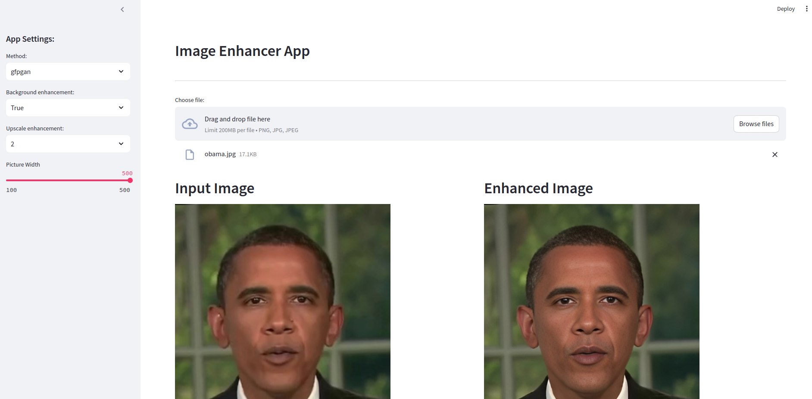

# AI Photo Enhancer
<a name="readme-top"></a>

<!-- ABOUT THE PROJECT -->
## Introduction
The Photo Enhancer, harnessing the capabilities of GFPGAN for face enhancement and RealESRGAN for background refinement, represents a groundbreaking advancement in image processing technology. This innovative solution offers a sophisticated method to enhance the visual quality of digital photos by meticulously enhancing facial features and background details separately. Through the utilization of cutting-edge Generative Adversarial Networks (GANs) and state-of-the-art deep learning architectures, the Photo Enhancer achieves remarkable improvements in image clarity, sharpness, and overall aesthetic appeal.

In the realm of photography, capturing and accentuating facial expressions and features is paramount, particularly in portrait photography and social media content. GFPGAN, a specialized GAN-based model for face enhancement, excels at refining facial details, enhancing skin texture, and improving overall facial aesthetics. By intelligently enhancing facial regions while preserving natural characteristics and identity, GFPGAN transforms ordinary portraits into captivating and visually stunning images.

Complementing facial enhancement, background refinement is equally critical for enhancing the overall visual impact of a photo. RealESRGAN, a state-of-the-art GAN-based model tailored for super-resolution tasks, specializes in upscaling and refining background elements such as landscapes, architecture, or scenic views. By effectively enhancing background details, textures, and spatial coherence, RealESRGAN elevates the overall quality and realism of the photo, creating a harmonious visual composition that captivates the viewer's attention.

The integration of GFPGAN for facial enhancement and RealESRGAN for background refinement in the Photo Enhancer represents a synergistic approach to photo enhancement. By separately processing facial and background regions, this approach ensures precise and targeted enhancements tailored to specific photo components, resulting in a visually compelling final output that retains the authenticity and natural beauty of the original scene.

The Photo Enhancer finds applications across various domains, including professional photography, social media content creation, digital artistry, and visual communication. Whether utilized by professional photographers to enhance portrait shots, content creators to elevate the quality of online content, or individuals seeking to enhance personal photographs, the Photo Enhancer offers a powerful and versatile tool for transforming ordinary photos into extraordinary works of art.

As research and development in GAN-based image enhancement techniques continue to advance, the Photo Enhancer stands as a testament to innovation, pushing the boundaries of what is possible in digital photo processing. By leveraging the capabilities of GFPGAN and RealESRGAN, this groundbreaking solution empowers users to unleash their creativity and elevate their visual storytelling to new heights, enriching the digital landscape with stunning and immersive photographic imagery.


<!-- ARCHITECTURE -->
## Architecture
### RealESRGAN
RealESRGAN, short for "Real-ESRGAN," stands as a pioneering solution in the realm of image enhancement, particularly renowned for its remarkable capabilities in super-resolution tasks. This state-of-the-art Generative Adversarial Network (GAN)-based model is designed to upscale low-resolution images with exceptional fidelity and detail, producing results that exhibit a striking level of realism and sharpness. RealESRGAN's architecture is optimized to handle various types of images, including photographs, textures, and digital artwork, enabling it to effectively enhance a wide range of visual content. Leveraging advanced deep learning techniques and extensive training on diverse datasets, RealESRGAN excels at preserving fine details, textures, and structural coherence, even in challenging scenarios where image quality may be compromised. As a testament to its effectiveness, RealESRGAN has garnered widespread acclaim within the computer vision and image processing communities, establishing itself as a cornerstone technology for high-quality image upscaling and enhancement applications. Please visit this <a href="https://github.com/xinntao/Real-ESRGAN/tree/master">link</a> to see details.

## GFPGAN
GFPGAN, or Generative Face Perfector GAN, stands at the forefront of facial enhancement technology, offering unparalleled capabilities in refining and beautifying facial features in digital imagery. This innovative Generative Adversarial Network (GAN)-based model is specifically engineered to enhance facial aesthetics with remarkable precision and realism, making it a valuable tool in portrait photography, digital artistry, and visual content creation. GFPGAN excels at smoothing skin texture, reducing blemishes, and enhancing facial details while preserving the natural characteristics and identity of the subject. By leveraging advanced deep learning techniques and extensive training on diverse facial datasets, GFPGAN achieves exceptional results in facial enhancement, empowering users to effortlessly elevate the visual appeal of their portraits and achieve stunning, magazine-worthy results. As a testament to its effectiveness, GFPGAN has garnered widespread recognition and adoption among professionals and enthusiasts alike, solidifying its position as a pioneering technology in the realm of facial image enhancement. Please visit this <a href="https://github.com/TencentARC/GFPGAN">link</a> to see details.
<p align="right">(<a href="#readme-top">Back to Top</a>)</p>

<!-- Used Technologies -->
## Used technologies
### FastAPI
FastAPI is a modern, fast (high-performance), web framework for building APIs with Python 3.7+ based on standard Python type hints. It is designed to be easy to use, while also being fast and efficient. Some key features and advantages of FastAPI include:

* Fast and High Performance: FastAPI is built on top of Starlette and Pydantic, utilizing asynchronous programming to achieve high performance. It is one of the fastest web frameworks available for Python.

* Automatic API Documentation: FastAPI automatically generates interactive API documentation (using Swagger UI and ReDoc) based on the Python type hints, making it easy for developers to understand, test, and consume the API.

* Type Hints and Data Validation: FastAPI uses Python type hints for request and response data, enabling automatic data validation. This helps catch errors early in the development process and improves the overall reliability of the API.

* Dependency Injection System: FastAPI provides a built-in dependency injection system, making it easy to manage and inject dependencies into route functions.

* Security: It comes with built-in security features, such as OAuth and JWT token support, which simplifies the implementation of secure authentication and authorization in APIs.

* WebSocket Support: FastAPI supports WebSocket communication, allowing real-time bidirectional communication between clients and the server.

* Synchronous and Asynchronous Code: FastAPI supports both synchronous and asynchronous code, making it flexible for different use cases and allowing developers to leverage the benefits of asynchronous programming when needed.

* Easy Integration with Other Libraries: FastAPI seamlessly integrates with other popular Python libraries and frameworks, such as SQLAlchemy, Tortoise-ORM, and others.

* Automatic Generation of API Client Code: Using the generated OpenAPI documentation, FastAPI can automatically generate API client code in multiple programming languages, reducing the effort required to consume the API.

* Active Development and Community Support: FastAPI is actively developed and has a growing community. The framework is well-documented, and its community actively contributes to its improvement.

Overall, FastAPI is a modern and powerful web framework that prioritizes developer productivity, type safety, and high performance, making it an excellent choice for building APIs with Python.

### Uvicorn
Uvicorn is an ASGI (Asynchronous Server Gateway Interface) server that is specifically designed to run ASGI applications, such as those built with the FastAPI web framework. ASGI is a specification for asynchronous web servers and applications in Python, providing a standard interface between web servers and Python web applications or frameworks.

Here are some advantages of using Uvicorn:

* ASGI Support: Uvicorn supports the ASGI specification, which is designed to handle asynchronous programming and enables the development of highly concurrent web applications.

* Fast and Efficient: Uvicorn is known for its high performance and efficiency, making it well-suited for handling concurrent connections and delivering fast responses.

* Compatibility with FastAPI: Uvicorn is the recommended server for running FastAPI applications. When paired with FastAPI, it allows developers to take full advantage of asynchronous programming and achieve optimal performance.

* Ease of Use: Uvicorn is easy to install and use. It can be started with a single command, making it accessible for developers at all levels.

* WebSocket Support: Uvicorn supports WebSocket communication, allowing real-time bidirectional communication between clients and the server. This is particularly useful for applications that require real-time updates.

* Graceful Shutdown: Uvicorn supports graceful shutdowns, allowing existing requests to finish processing before the server stops. This helps maintain the stability and reliability of the application.

* Configuration Options: Uvicorn provides various configuration options, allowing developers to customize the server settings based on the requirements of their applications.

* TLS/SSL Support: Uvicorn supports TLS/SSL encryption, providing a secure way to transmit data over the network.

* Active Development and Community Support: Uvicorn is actively maintained and has a supportive community. Regular updates and contributions from the community ensure that the server stays up-to-date and improves over time.

* Integration with Other ASGI Frameworks: While commonly used with FastAPI, Uvicorn is not limited to a specific framework. It can be used with other ASGI frameworks and applications, providing flexibility and compatibility.

In summary, Uvicorn is a versatile and performant ASGI server that excels in handling asynchronous web applications. Its compatibility with FastAPI and support for WebSocket communication make it a popular choice for developers building modern, real-time web applications with Python. 

For this project, Uvicorn is using 3 workers. This means there will 3 subprocesses and the users can send requests in parallel. With this feature, the server can accept more than one request at the same time. You can increase the worker number regarding to your VRAM.

<p align="right">(<a href="#readme-top">Back to Top</a>)</p>

<!-- GETTING STARTED -->
## Getting Started - CLI
Instructions on setting up your project locally and using CLI.
To get a local copy up and running follow these simple steps.

### Install dependencies
To install the required packages, in a terminal, type:
  ```sh
  pip install -r requirements.txt
  ```

### Run the project
To run the project, in a terminal, type:
  ```sh
  python main.py --method gfpgan --image_path samples/family.jpg --output_path output_x2.jpg --upscale 2
  ```
You will see the output image in the given output path.

## Getting Started - Uvicorn
Instructions on setting up your project locally.
To get a local copy up and running follow these simple steps.

### Install dependencies
To install the required packages, in a terminal, type:
  ```sh
  pip install -r requirements.txt
  ```

### Run the project
To run the project, in a terminal, type:
  ```sh
  uvicorn app:app --proxy-headers --host 0.0.0.0 --port 8000 --workers 3
  ```
Then, visit <a href="http://localhost:8000/docs">http://localhost:8000/docs</a> to see the endpoints.

## Getting Started - Docker
Instructions on setting up your project locally using Docker.
To get a local copy up and running follow these simple steps.

### Build Docker
To build the Docker image, in a terminal, type:
  ```sh
  docker build -t enhancer -f Dockerfile .
  ```

### Run the container
To run the container, in a terminal, type:
  ```sh
  docker run -it -d --gpus all --name enhancer -p 80:80 enhancer
  ```
Then, visit <a href="http://localhost/docs">http://localhost/docs</a> to see the endpoints.

## Run the streamlit app
To run the streamlit app, in a terminal, type:
  ```sh
  streamlit run streamlit_app.py --server.enableXsrfProtection false
  ```
Then, the streamlit app will launch in a new window.



<p align="right">(<a href="#readme-top">Back to Top</a>)</p>
